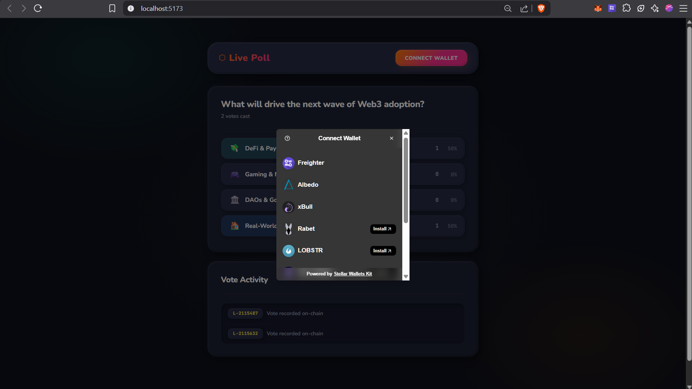

# ⬡ Stellar Live Poll dApp

> On-chain voting powered by Soroban smart contracts on the Stellar Testnet.

---

## Overview

Stellar Live Poll is a decentralized voting application that records immutable votes on the Stellar blockchain using Soroban smart contracts. Users connect a Stellar wallet, pick their answer to a community question, and their vote is permanently recorded on-chain — with real-time results updating as new votes arrive through contract event streaming.

Built with a **dark claymorphism** interface featuring soft pillowy 3D clay surfaces and warm gradient accents.

## Screenshots



## Deployed Contract

| Field | Value |
|---|---|
| **Network** | Stellar Testnet |
| **Contract Address** | `CBBADGQAX6F4NGXRKTC2UJ7P46RC6AVOZLK2EWKDR6QVFYSAG2IFXJGB` |
| **Explorer** | [View on Stellar Expert](https://stellar.expert/explorer/testnet/contract/CBBADGQAX6F4NGXRKTC2UJ7P46RC6AVOZLK2EWKDR6QVFYSAG2IFXJGB) |
| **Init Tx** | `ed00be74725fe5fcec412eb931c41a5bd407fab5948ea0b631fe2a0460c32ea5` |

## Capabilities

- **Multi-Wallet Integration** — Connects to Freighter and Albedo through `@creit.tech/stellar-wallets-kit`, supporting connection, disconnection, and transaction signing.
- **On-Chain Voting** — Each vote calls `cast_vote` on the Soroban contract, requiring voter authorization and preventing double voting.
- **Live Results** — Poll results update every 6 seconds by querying contract state directly via Soroban RPC simulation.
- **3 Error Types Handled**:
  1. **Wallet not connected** — prompts user to connect before voting
  2. **Double vote prevention** — contract rejects if address already voted
  3. **Insufficient balance / simulation failure** — caught during transaction simulation
- **Transaction Status Tracking** — Animated status indicators for pending, success, and failure states.
- **Real-Time Event Feed** — Polls `server.getEvents` every 5 seconds to display live vote activity from the ledger.

## Architecture

```
├── live_poll/                # Soroban smart contract (Rust)
│   ├── Cargo.toml
│   └── src/
│       └── lib.rs            # Contract: cast_vote, get_votes, get_total, has_voted, init
│
└── frontend/                 # React + Vite + TypeScript
    ├── src/
    │   ├── App.tsx           # Poll UI with voting, results, event feed
    │   ├── main.tsx          # Entry point with Buffer polyfill
    │   └── index.css         # Dark claymorphism theme + poll components
    ├── vite.config.ts        # Manual Node polyfills for browser
    └── index.html
```

## Smart Contract Interface

The `LivePollContract` exposes five functions:

| Function | Parameters | Description |
|---|---|---|
| `init` | _none_ | Initializes vote counters to zero |
| `cast_vote` | `voter: Address`, `option_id: u32` | Records a vote — requires auth, prevents double-voting, emits event |
| `get_votes` | `option_id: u32` | Returns vote count for a specific option |
| `get_total` | _none_ | Returns total vote count across all options |
| `has_voted` | `voter: Address` | Checks whether an address has already voted |

## Running Locally

```bash
cd frontend
npm install
npm run dev
```

Open `http://localhost:5173/` in your browser, connect a Stellar wallet (Freighter recommended), and cast your vote.

## Building the Contract

```bash
cd live_poll
stellar contract build
```

Output: `target/wasm32v1-none/release/live_poll.wasm`

## Deploying to Testnet

```bash
stellar contract deploy \
  --wasm target/wasm32v1-none/release/live_poll.wasm \
  --network testnet \
  --source <identity>

# Initialize after deployment
stellar contract invoke --id <CONTRACT_ID> --network testnet --source <identity> -- init
```

## Tech Stack

| Layer | Technology |
|---|---|
| Smart Contract | Rust + Soroban SDK 22.0 |
| Frontend | React 19, TypeScript, Vite 8 |
| Wallet | Stellar Wallets Kit v2 (Freighter, Albedo) |
| RPC | Stellar Soroban RPC (Testnet) |
| Styling | Vanilla CSS — dark claymorphism with soft 3D surfaces |
